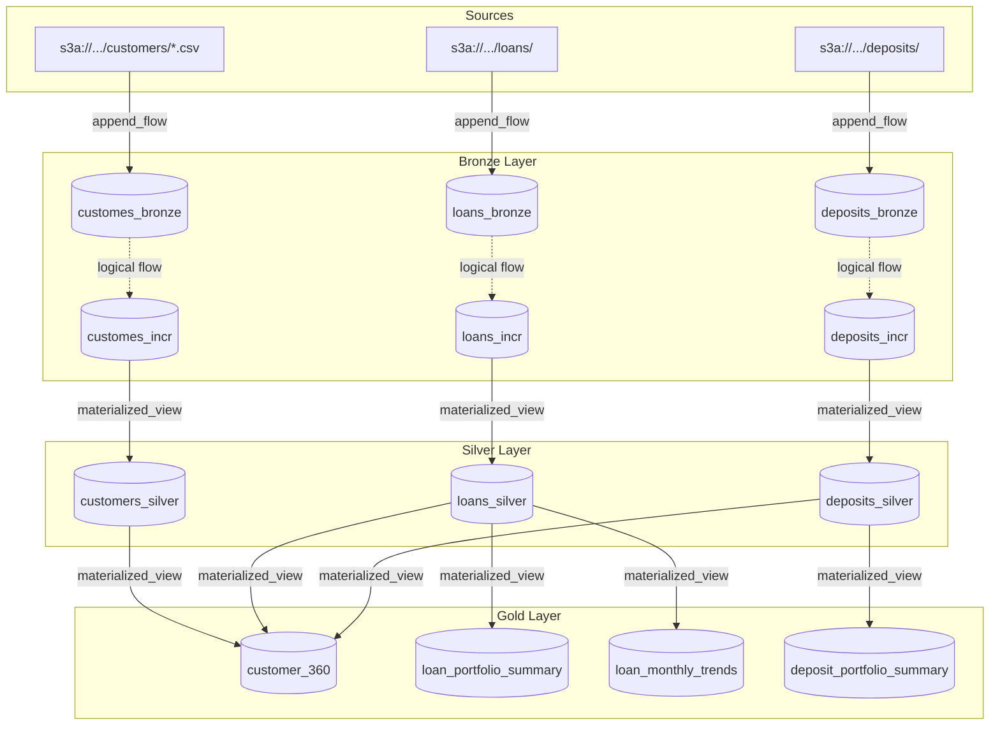

# Building a Spark Declarative Pipeline: A Modern Financial Data Lakehouse with SDP, Apache Iceberg, and AWS Glue

Data engineering is evolving rapidly, and the shift from traditional data warehouses to modern, open data lakehouses is in full swing. However, as data architectures grow, the complexity of managing imperative Spark code grows with it. If you are dealing with massive amounts of data—like millions of customer records, loan details, and banking deposits—you need an architecture that is not only scalable but also extremely easy to manage.

In this post, I will walk you through a recent project where we built a full **Spark Declarative Pipeline**. By moving away from imperative code and leveraging **Spark Connect**, **Apache Iceberg** as our table format, and **AWS Glue** as our data catalog, we've created a seamless, configuration-driven Medallion Architecture. 

---

## 🏗️ The Architecture and Tech Stack: Built for Declarative Data Flows

To build a robust and entirely configuration-driven pipeline, we selected a modern tech stack uniquely suited for a declarative approach:

*   **Spark Declarative Pipelines (SDP):** Instead of writing hundreds of lines of imperative PySpark transformations, we leveraged the **Spark Declarative Pipelines (`pyspark.pipelines`)** framework. By using Python decorators like `@dp.table` and `@dp.materialized_view`, we define *what* the data should look like, not *how* to compute it. The `spark-pipelines` CLI and its `spark-pipeline.yml` project specification drastically reduce boilerplate and automatically manage execution and dependencies.
*   **Apache Spark & Spark Connect:** We used Spark as our underlying execution engine. Crucially, by utilizing **Spark Connect** (`sc://localhost:15002`), we decoupled our pipeline orchestrator from the Spark cluster. This thin-client architecture is perfect for declarative setups, allowing our applications to submit jobs dynamically from anywhere without a heavy local JVM environment.
*   **Apache Iceberg (Table Format):** Iceberg acts as the open table format on top of our data lake. For a declarative pipeline, having a reliable table format is non-negotiable. Iceberg brings ACID transactions, seamless schema evolution, and time travel to S3, ensuring that our declarative transformations and state updates execute flawlessly without data corruption.
*   **AWS Glue (Data Catalog) & S3:** We utilized AWS S3 for object storage and **AWS Glue** as our central metadata catalog (`org.apache.iceberg.aws.glue.GlueCatalog`). Glue provides a unified, serverless catalog that perfectly complements Iceberg and Spark Connect, allowing our declarative queries to effortlessly discover and interact with tables across the entire lakehouse.

---

## ⚙️ Environment Setup

To get this declarative pipeline running locally, we need to spin up the Spark Connect server and provide the necessary packages and configurations for Iceberg and AWS Glue.

### 1. AWS Credentials & Permissions

Before running the pipeline, ensure you have the necessary AWS credentials configured (e.g., via `~/.aws/credentials` or environment variables). Your AWS IAM user or role must have permissions to:
* Read and write to your target S3 bucket.
* Access and modify the AWS Glue Data Catalog.

*(Note: For the purpose of this blog, I used an account with Admin privileges to avoid permission hiccups, but in production, you should use scoped-down IAM policies).*

### 2. Configuring Spark Defaults

Next, we define our `spark-defaults.conf` (or pass these as configurations when building the Spark session) to wire everything up. Make sure to replace the masked S3 bucket name with your actual bucket:

```properties
# === Iceberg + Glue Catalog Setup ===
spark.sql.extensions                                org.apache.iceberg.spark.extensions.IcebergSparkSessionExtensions
spark.sql.catalog.glue                              org.apache.iceberg.spark.SparkCatalog
spark.sql.catalog.glue.catalog-impl                 org.apache.iceberg.aws.glue.GlueCatalog
spark.sql.catalog.glue.warehouse                    s3://<YOUR_S3_BUCKET_NAME>/warehouse/
spark.sql.catalog.glue.io-impl                      org.apache.iceberg.aws.s3.S3FileIO
spark.sql.defaultCatalog                            glue
spark.sql.catalog.glue.default-namespace            demo_ps_db

# === Hadoop S3A (for reading raw CSVs) ===
spark.hadoop.fs.s3a.impl                            org.apache.hadoop.fs.s3a.S3AFileSystem
spark.hadoop.fs.s3a.aws.credentials.provider        com.amazonaws.auth.DefaultAWSCredentialsProviderChain
spark.hadoop.fs.s3a.connection.timeout              60000
spark.hadoop.fs.s3a.socket.timeout                  60000
spark.hadoop.fs.s3a.connection.establish.timeout    60000
spark.hadoop.fs.s3a.attempts.maximum                10
spark.hadoop.fs.s3a.connection.maximum              200
spark.hadoop.fs.s3a.fast.upload                     true

# === Spark Connect Settings ===
spark.connect.grpc.binding.port                     15002
spark.connect.grpc.maxInboundMessageSize            128m

# === Resource Allocation ===
spark.driver.memory                                 4g
spark.executor.memory                               8g
spark.executor.cores                                4
```

### 3. Starting the Spark Connect Server

With the configuration in place, we start the standalone Spark Connect server, ensuring we inject the required dependencies for Iceberg and the AWS SDK:

```bash
start-connect-server.sh \
  --packages org.apache.iceberg:iceberg-spark-runtime-4.0_2.13:1.10.1,\
org.apache.iceberg:iceberg-aws-bundle:1.10.1,\
org.apache.hadoop:hadoop-aws:3.5.0,\
com.amazonaws:aws-java-sdk-bundle:1.12.782
```

With this server running, our client applications simply connect to `sc://localhost:15002` and all declarative queries are seamlessly routed through the catalog to our data lake.

---

## 🏦 The Use Case: Financial Data

To make this realistic, we generated a comprehensive mock dataset (using Python, Pandas, and Numpy) simulating a retail bank:
1.  **Customers:** 10,000 records with demographic and KYC details.
2.  **Loans:** 15,000 records detailing loan types, interest rates, EMIs, and statuses.
3.  **Deposits:** 20,000 records tracking fixed deposits (FDs), recurring deposits (RDs), and savings accounts.

All this raw data was initially dumped into S3 as CSV files. Our goal was to transform this raw data into business-ready insights.

---

## 🏅 The Medallion Architecture in Action

The core of our pipeline follows the Medallion Architecture pattern: **Bronze** (Raw), **Silver** (Cleansed), and **Gold** (Aggregated). 

Here is the visual representation of our Directed Acyclic Graph (DAG):



### 🥉 Bronze Layer: Raw Data Ingestion
The first step is moving data from raw S3 CSV files into Iceberg tables. In our Bronze layer, we utilized the `@dp.append_flow` decorator to continuously read new files and append them to our `_bronze` tables. Because we are using Iceberg, we don't have to worry about corrupting the table if a job fails mid-write.

Here is an example of what our declarative definition looks like for the raw deposits data (`deposits_raw.py`):

```python
from pyspark import pipelines as dp
from pyspark.sql import SparkSession, DataFrame
from schemas.schemas import DEPOSITS_BRONZE_SCHEMA

spark = SparkSession.active()

# 1. Define the target streaming table
dp.create_streaming_table(name="deposits_bronze")

# 2. Define the append flow that populates it
@dp.append_flow(target="deposits_bronze")
def deposit_incr_flow() -> DataFrame:
    return (
        spark
        .readStream
        .schema(DEPOSITS_BRONZE_SCHEMA)
        .option("header", "true")
        .option("maxFilesPerTrigger", 50)
        .csv("s3a://<YOUR_S3_BUCKET_NAME>/deposits/")
    )
```

**What's happening here?**
* We use `dp.create_streaming_table()` to declare that we want an Iceberg streaming table named `deposits_bronze` to exist. 
* The `@dp.append_flow(target="deposits_bronze")` decorator tells the SDP engine that the output of the `deposit_incr_flow` function should be continuously appended to that target.
* The function itself just returns a pure PySpark streaming DataFrame. Notice there are no `.writeStream`, no explicit checkpoint paths, and no `.start()` calls—the SDP framework automatically manages all the underlying streaming mechanics!

### 🥈 Silver Layer: Cleansing and Structuring
Once data lands in the Bronze layer, we process it into the Silver layer. Here, we used the `@dp.materialized_view` decorator to build **Materialized Views** (`customers_silver`, `loans_silver`, `deposits_silver`) that clean the data, enforce schema types, cast strings to timestamps, and filter out invalid records. The SDP framework automatically handles the underlying orchestration.

Here is the snippet for the Silver deposits view (`deposits_silver.py`):

```python
from pyspark import pipelines as dp
from pyspark.sql import SparkSession, DataFrame
from pyspark.sql import functions as F

spark = SparkSession.active()

@dp.materialized_view
def deposits_silver() -> DataFrame:
    # Read from the bronze target (abstracted as a table)
    df = spark.read.table("deposits_incr")
    
    return (df 
        .withColumn("days_to_maturity", F.datediff(F.col("maturity_date"), F.current_date())) 
        .withColumn("maturity_status",
            F.when(F.col("days_to_maturity") <= 0, "matured")
             .when(F.col("days_to_maturity") <= 30, "maturing_soon")
             .otherwise("active")
        ) 
        .withColumn("annual_interest_earned", F.col("principal_amount") * F.col("interest_rate") / 100)
    )
```

**What's happening here?**
* We use `@dp.materialized_view`, telling Spark to maintain this logic as an Iceberg table.
* The function reads from `deposits_incr` (defined in the Bronze layer) just like a normal table using `spark.read.table()`.
* We apply our PySpark DataFrame transformations (date math, conditionals, etc.) and simply return the dataframe. SDP will handle the incremental `MERGE` or `OVERWRITE` operations against the Silver Iceberg table.

### 🥇 Gold Layer: Business Intelligence
The final layer is where the real value is extracted. We created Gold level materialized views that serve directly as the backend for dashboards and analytics:
*   **`customer_360`:** A master view joining Customers, Loans, and Deposits to give a complete view of a user's relationship with the bank.
*   **`loan_portfolio_summary` & `loan_monthly_trends`:** Aggregations analyzing active vs. defaulted loans, total sanctioned amounts, and monthly growth.
*   **`deposit_portfolio_summary`:** Insights into total liabilities the bank holds across different deposit types.

Here is what the `deposit_portfolio_summary` logic looks like (`deposit_portfolio.py`):

```python
from pyspark import pipelines as dp
from pyspark.sql import DataFrame, SparkSession, functions as F

spark = SparkSession.active()

@dp.materialized_view(name="deposit_portfolio_summary")
def build_deposit_summary() -> DataFrame:
    # Read the cleansed data from Silver
    df = spark.read.table("deposits_silver")

    # Aggregate by deposit type and status
    return df.groupBy("deposit_type", "maturity_status").agg(
        F.count("deposit_id").alias("deposit_count"),
        F.sum("principal_amount").alias("total_principal"),
        F.sum("interest_earned").alias("total_interest"),
        F.avg("interest_rate").alias("avg_interest_rate")
    ).withColumn("interest_cost_pct",
        F.when(F.col("total_principal") > 0, 
               F.col("total_interest") / F.col("total_principal") * 100).otherwise(0)
    )
```

**What's happening here?**
* Notice we explicitly passed `name="deposit_portfolio_summary"` to the decorator. This allows us to name the function something descriptive (`build_deposit_summary`) while ensuring the underlying Iceberg table retains a clean, business-friendly name.
* The aggregation logic is standard PySpark. Because it's wrapped in SDP, any BI tool can simply query the Gold table `deposit_portfolio_summary` directly from the AWS Glue Catalog with high performance, completely unaware of the Spark pipeline feeding it.

---

## 💡 Key Takeaways

1.  **SDP is the Future:** Embracing the native **Spark Declarative Pipelines** framework was the biggest win. By defining datasets using simple decorators (`@dp.table`, `@dp.materialized_view`, `@dp.append_flow`) rather than imperative code, we eliminated fragile loop logic, accelerated development, and allowed the `spark-pipelines run` CLI to completely handle pipeline execution and dependency graphs.
2.  **The Perfect Trio (Iceberg + Glue + Spark Connect):** The combination of Apache Iceberg as a reliable table format and AWS Glue as the centralized data catalog provided the robust foundation needed for declarative operations and schema management.
3.  **Spark Connect Enables Modern Orchestration:** Spark Connect’s decoupled architecture perfectly complemented our declarative approach, allowing us to dynamically trigger data flows remotely without traditional heavyweight Spark driver dependencies.

## Conclusion
Building a Medallion Architecture on top of Apache Iceberg and PySpark provides a robust, scalable foundation for any data-intensive application. As the ecosystem matures, the combination of open table formats and decoupled compute (Spark Connect) is making data engineering more accessible and reliable than ever.

